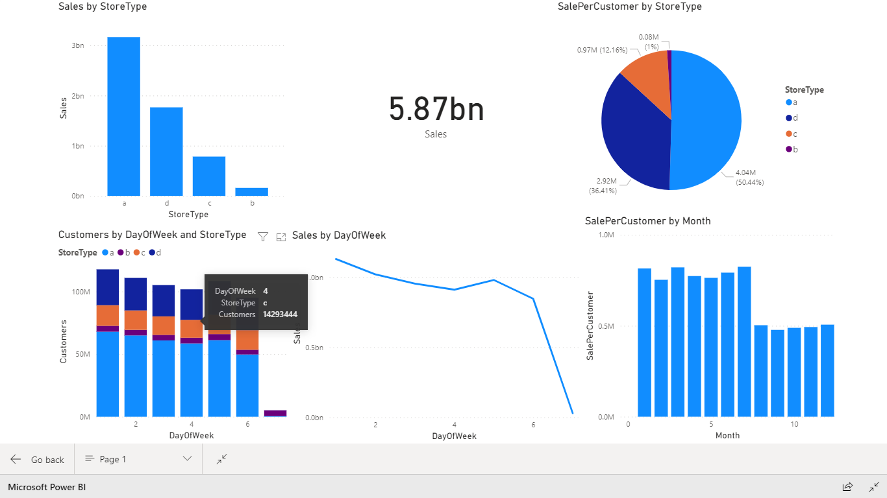
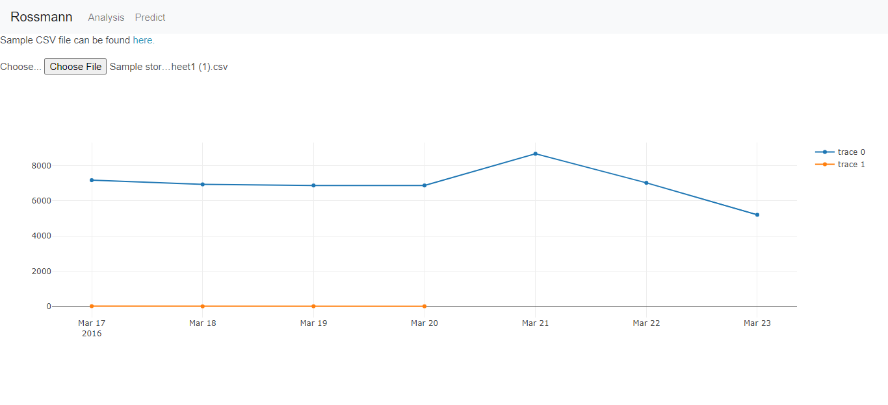
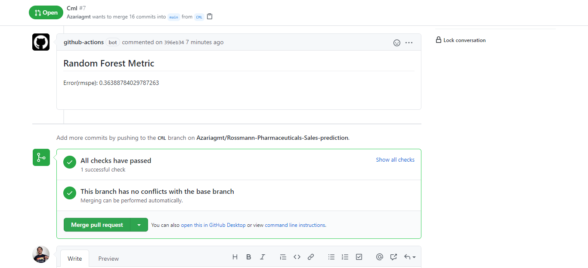



# Rossmann Store Sales

## Forecast sales using store, promotion, and competitor data

For companies to strive in this competitive market, they need to leverage the power of AI/ML in their day-to-day decision-making endeavors. Forecasting the number of sales and customers they’re going to have is a keen advantage and one can leverage either promotions or different marketing schemes to increase the income flow. Predictive models can take into account different historical effects like seasonality, holidays, promotions, and competitions like we see later on to make the most accurate predictions.

The data we’re going to use for this project is Rossmann’s store data which can be found here
In this data, there are four files-- the train, store, test, and sample_submission CSV files

### Data

Id - an Id that represents a (Store, Date) duple within the test set

DayOfWeek

Date

Store - a unique Id for each store

Sales - the turnover for any given day (this is what you are predicting)

Customers - the number of customers on a given day

Open - an indicator for whether the store was open: 0 = closed, 1 = open

StateHoliday - indicates a state holiday. Normally all stores, with few exceptions, are closed on state holidays. Note that all schools are closed on public holidays and weekends. a = public holiday, b = Easter holiday, c = Christmas, 0 = None

SchoolHoliday - indicates if the (Store, Date) was affected by the closure of public schools

### Usage

This is a containerized flask application with docker image put on docker hub. If heroku url is not working or want to do some development you can
Pull docker image

```
docker pull 0941924816/rossmann-sales-prediction
```

Run docker image

```
docker run --rm -it  -p 8000:8000/tcp 0941924816/rossmann-sales-prediction:latest
```

### Analysis dashboard

Dashboard for existing data using powerbi for easier analysis of data more specifically sales and sales per customer for the different store types available in Rossmann.

### Prediction dashboard

After putting in a CSV file in the prediction page you'll get a plotly line graph showing the sales output for that CSV. The CSV file should be similar to the format found here. The blue lines indicate the Sale to be expected. `<br>`
!Feature to predict customer number is yet to be implemented



### MLOps integration

working CML is integrated with every PR making sure new changes in model show how much our error has decreased(using RMSPE)


